**Exploratory Data Analysis (EDA) Notes**

## Basic Questions to Ask When Analyzing Data:
1. **Shape** - Find the dimensions of the dataset.
2. **Describe** - Get summary statistics for numerical columns.
3. **Info** - Check data types and missing values.

## Types of EDA:
EDA can be broadly divided into:
1. **Univariate Analysis** - Understanding individual columns.
2. **Bivariate/Multivariate Analysis** - Analyzing relationships between two or more variables.

---

## **Univariate Analysis**
### **Categorical Data**
#### **Countplot**
Plots the frequency of different categories within a column.

**Syntax:**  
```python
sns.countplot(x=df["Pclass"])
```
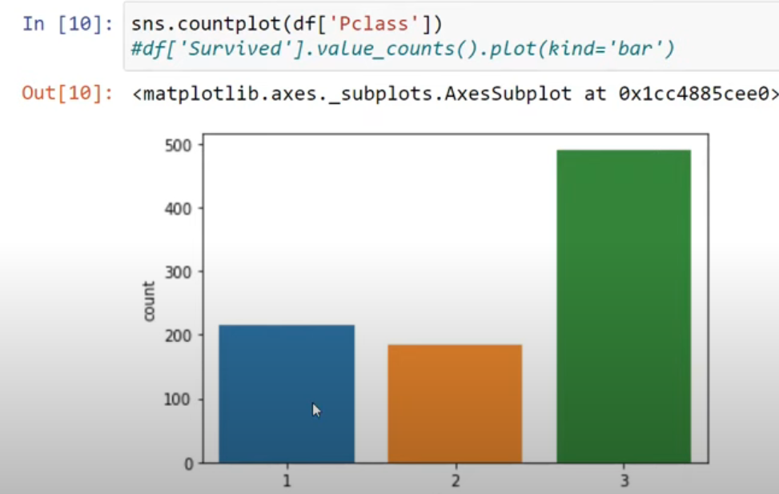


#### **Pie Chart**
Displays categorical distribution in a circular format.

**Syntax:**  
```python
df["Survived"].value_counts().plot(kind="pie", autopct='%2.f%%')
```
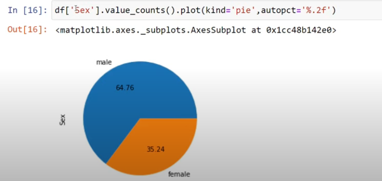

---

### **Numerical Data**
#### **Histogram**
Shows the distribution of numerical data by dividing it into bins.

**Syntax:**  
```python
import matplotlib.pyplot as plt
plt.hist(df["Age"], bins=20)
```
- `bins=20`: Divides the data into 20 ranges.

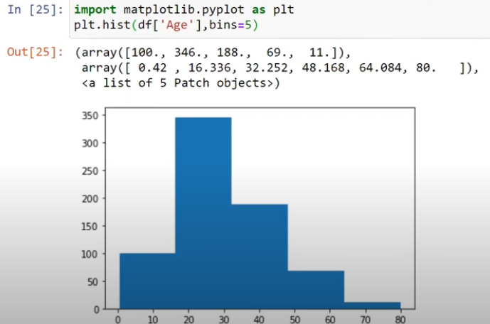

#### **Distplot**
Similar to a histogram but includes a probability density function (PDF).

**Syntax:**  
```python
sns.distplot(df["Age"], bins=20, kde=True)
```
- `kde=True`: Enables Kernel Density Estimation (KDE) curve.

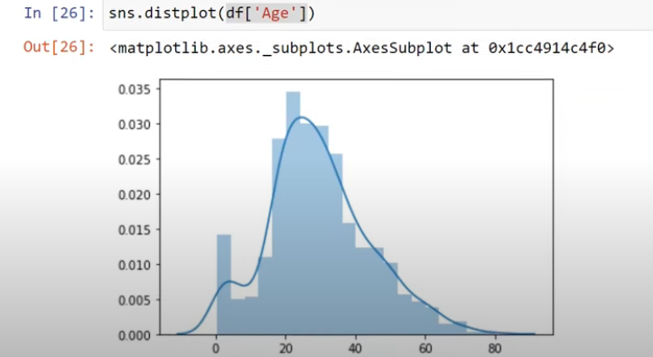

#### **Skewness**
Measures the asymmetry of the distribution.

**Syntax:**  
```python
df["Age"].skew()
```
- Positive: Right skewed.
- Negative: Left skewed.

#### **Boxplot**
Shows the five-number summary and detects outliers.

**Syntax:**  
```python
sns.boxplot(y=df["Age"])
```
- **Five-number summary:** Minimum, Q1 (25%), Median, Q3 (75%), Maximum.
- **Outliers:** Data points beyond `1.5 * IQR` from Q1 or Q3.

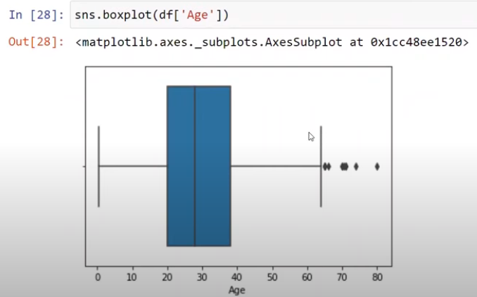

---

## **Bivariate/Multivariate Analysis**

### **Scatter Plot**
Used to visualize relationships between two numerical columns.

**Syntax:**  
```python
sns.scatterplot(x=df['x'], y=df['y'])
```

To add more details (e.g., categories and size):
```python
sns.scatterplot(x=df['x'], y=df['y'], hue=df["sex"], style=df['smoker'], size=df["size"])
```
- `hue`: Differentiates data points by color.
- `style`: Uses different markers for categorical data.
- `size`: Adjusts point size based on another variable.

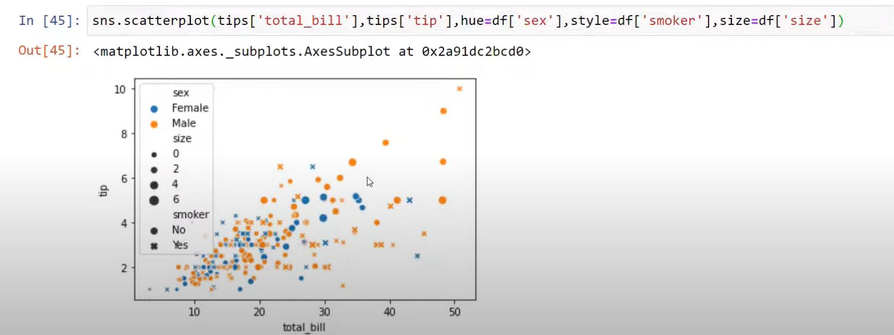

---

### **Bar Plot**
Shows the average of a numerical column based on a categorical column.

**Syntax:**  
```python
sns.barplot(x=df['sex'], y=df['age'])
```

Grouped by another categorical column:
```python
sns.barplot(x=df['Pclass'], y=df['age'], hue=df['sex'])
```
- `hue`: Adds an additional categorical grouping.

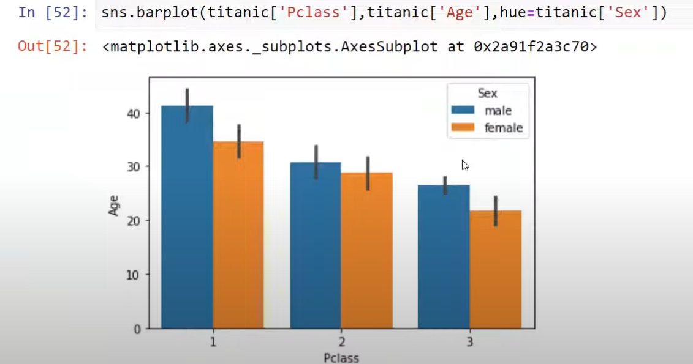

---

### **Box Plot (Multiple Variables)**
Compares numerical distributions across categories.

**Syntax:**  
```python
sns.boxplot(x=df['sex'], y=df['age'])
```

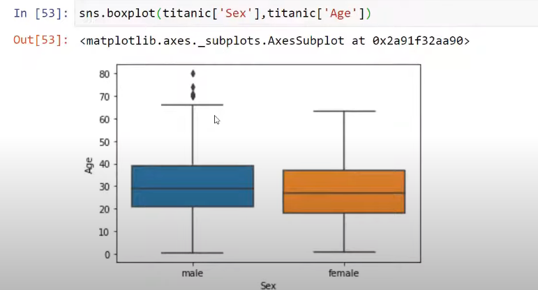

---

### **Distplot (Multiple Variables)**
Plots PDF for different categories on the same plot.

**Syntax:**  
```python
sns.histplot(df[df['Survived'] == 1]['Age'], kde=True, label='Survived')
sns.histplot(df[df['Survived'] == 0]['Age'], kde=True, label='Not Survived')
```
- `label`: Differentiates each category.

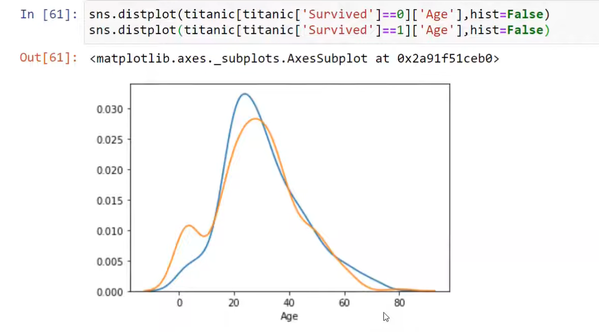

---

### **Heatmap**
Visualizes the intensity of data using a color gradient.

**Syntax:**  
```python
data = pd.crosstab(df['Survived'], df['Pclass'])
sns.heatmap(data, annot=True, cmap='coolwarm')
```
- `annot=True`: Displays values on the heatmap.
- `cmap`: Defines color scheme.

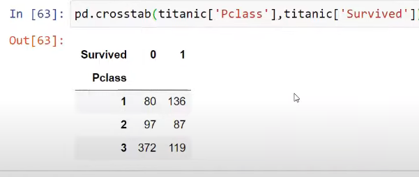

---

### **Cluster Map**
Clusters similar categories using dendrograms.

**Syntax:**  
```python
data = pd.crosstab(df['Survived'], df['Pclass'])
```

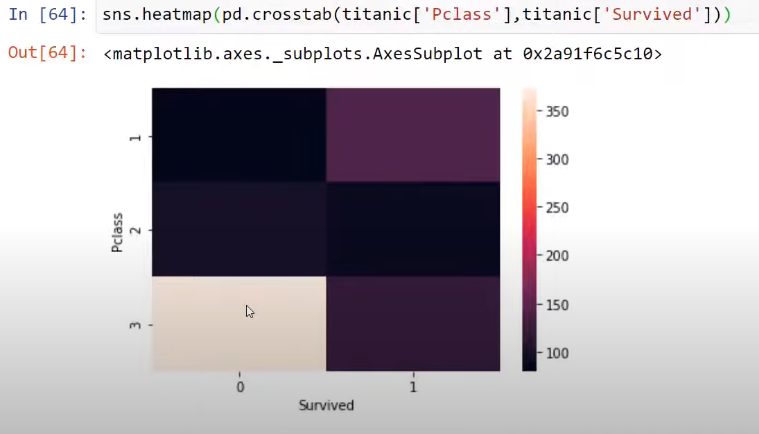

```python
sns.clustermap(data)
```

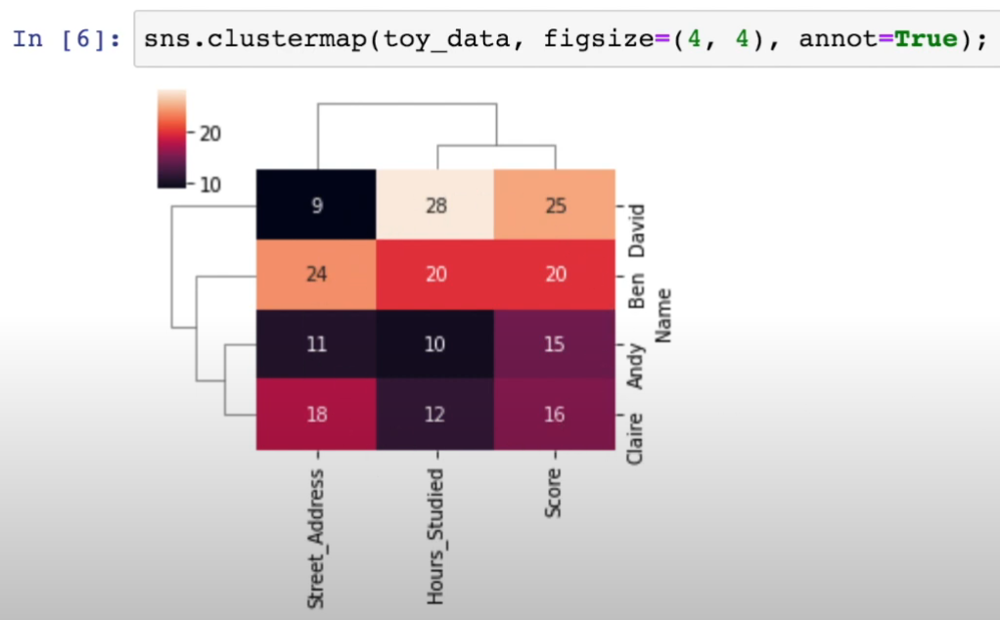

---

### **Pairplot**
Plots scatter plots for all numerical column pairs.

**Syntax:**  
```python
sns.pairplot(df)
```

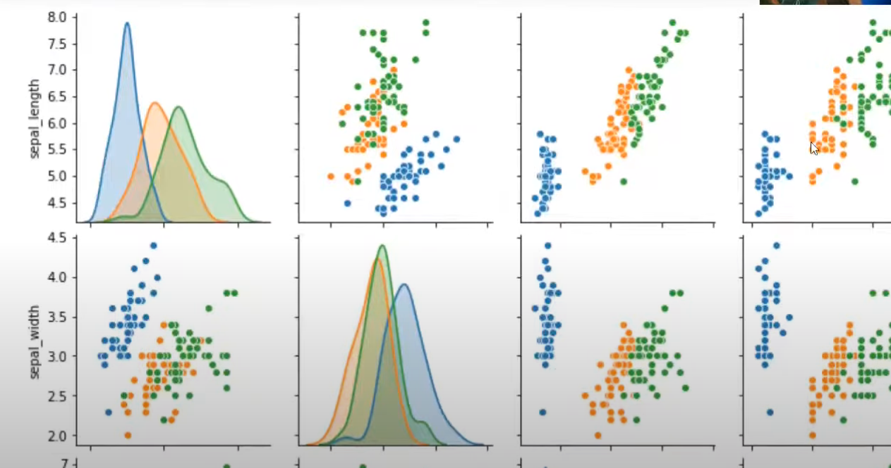

---

### **Line Plot**
Shows the trend of a numerical variable over time or sequence.

**Syntax:**  
```python
sns.lineplot(x=df['years'], y=df['passenger'])
```

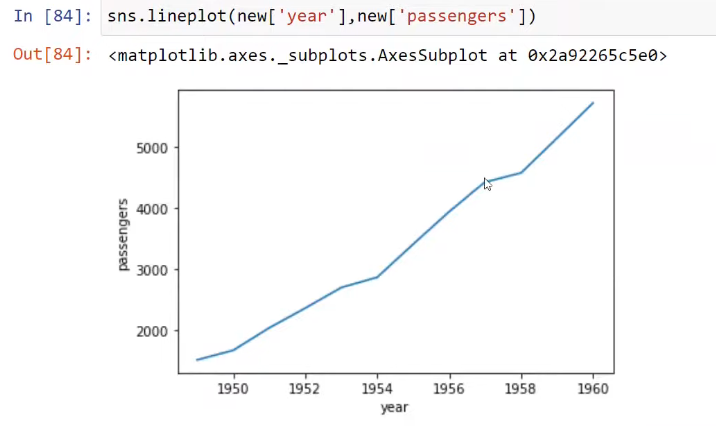

---

